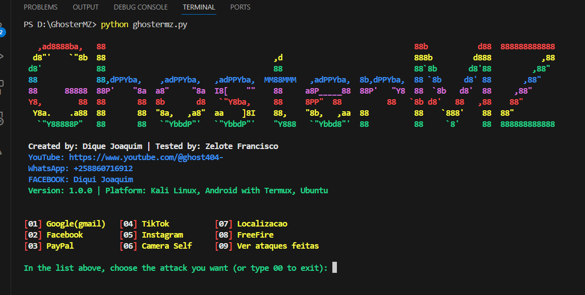

# GhosterMZ


## Version: 1.0.0

### Overview
GhosterMZ is a tool designed to demonstrate how website phishing works. My name is Dique Joaquim, a programmer in JavaScript and Python from Mozambique. I created this tool to challenge and showcase my knowledge. This project was inspired by htr-tech's zphisher (https://github.com/htr-tech/zphisher), which is written in Bash and PHP. GhosterMZ is built using Python with the Flask framework for backend and HTML, CSS, and JavaScript for frontend.

## Getting Started
To use GhosterMZ, you'll need a Linux terminal on either a computer or Android device, along with Python 3 installed. The tool uses Flask and cloudflared for tunneling. Installation is simplified with a Python script that detects your machine's architecture and downloads the appropriate files.

### Installation
Clone the repository:
```bash
git clone https://github.com/your-username/GhosterMZ.git
```
Open the Folder
```bash
cd GhosterMZ
```
Install required libs (Instalar as bibliotecas necessárias)
```bash
pip install -r requirements.txt
```
### Test Run (rodar a ferramenta)
First we need configure the tunnel(Configurar o túnel)
```bash
python cloudtunnel.py
```
and run the tool (e execute a ferramenta)
```bash
python ghostermz.py
```
<p align="left">
  <a href="https://github.com/diguijoaquim/GhosterMZ.git" target="_blank"></a>
</p>
<h2>Me encontre no:</h2>
<a href='https://www.facebook.com/profile.php?id=100091313717660'>
  
</a>
<a href='https://www.youtube.com/@ghost404-'>
  
</a>
